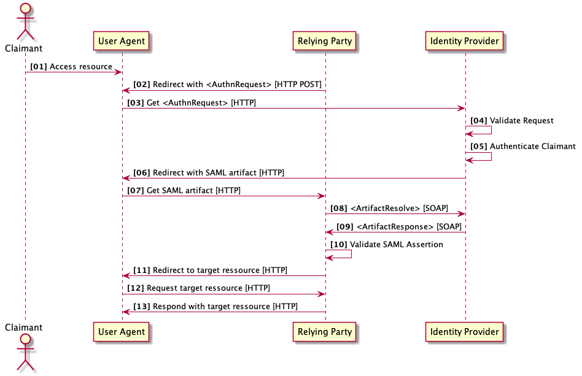

# Authenticate User
Transaction to authenticate a user at a identity provider certified for the Swiss EPR. Primary systems shall use this transaction to retrieve a IdP assertion. The IdP assertion is required to retrieve the XUA Assertion to be used with EPR transactions.

- [Overview](#overview)
- [Transactions](#transactions)
	* [Authentication Request](#authentication-request)
	* [Artifact Resolve](#artifact-resolve)
	* [Adit Log](#audit-log)
- [Test Opportunity](#test-opportunity)

# Overview

Primary systems shall use this transaction to retrieve an IdP assertion authentication the user for the access to the
Swiss EPR.

The requirements for the transaction are defined in
**[Annex 8](https://www.bag.admin.ch/dam/bag/de/dokumente/nat-gesundheitsstrategien/strategie-ehealth/gesetzgebung-elektronisches-patientendossier/gesetze/Anhang%208%20Ausgabe%202.pdf.download.pdf/DE_EPDV-EDI_Anhang_8_Ausgabe2.pdf)** of the ordinances of the Swiss EPR.

The EPR requires primary systems to implement authentication as described in the SAML 2.0 specification family, i.e.,
- **[Assertions and Protocols for the OASIS Security Assertion Markup Language (SAML) V2.0](http://docs.oasis-open.org/security/saml/v2.0/saml-core-2.0-os.pdf)**.
- **[Bindings for the OASIS Security Assertion Markup Language (SAML) V2.0](http://docs.oasis-open.org/security/saml/v2.0/saml-bindings-2.0-os.pdf)**.
- **[Profiles for the OASIS Security Assertion Markup Language (SAML) V2.0](http://docs.oasis-open.org/security/saml/v2.0/saml-profiles-2.0-os.pdf)**.

Primary systems do need implement all the bindings and profiles supported by the SAML 2.0 specification family.

In the Swiss EPR the following bindings are required:
- HTTP POST Binding.
- HTTP Artifact Binding.
- SAML SOAP Binding.    

In the Swiss EPR the following profiles are required:
- Web Browser SSO Profile.
- Single Logout Profile.

The usage of the profiles and binding used to authenticate user for the Swiss EPR is described in the following sections.

# Transactions

The transaction to authenticate a user for the access to the Swiss EPR is a multi-step flow consisting of HTTP Post and SOAP Web Service calls, as displayed in the following figure:



**Figure 1: Authentication Sequence Diagram**

The sequence consists of the following steps, each using assigned transaction messages:

- [01 .. 04] The user (claimant) is redirected to the identity provider via the user agent (browser) with a SAML 2.0 *AuthnRequest* message.
- [05] The user (claimant) authenticates at the identity provider with her authentication means.
- [06 .. 07] The identity provider responds a SAML 2.0 artifact in a HTTP redirect to the primary system (relying party).  
- [08] The primary system sends a *ArtifactResolve* message to resolve the SAML artifact to the SAML 2 IdP Assertion via the SOAP backchannel.
- [09] The IdP responds the IdP Assertion in the *ArtifactResponse* message.

## Authentication Request

The transaction shall be performed by the primary system when the user aims to access the EPR. The primary system shall
redirect the user agent (browser) to the IdP authentication endpoint with a *AuthnRequest* message as defined in
**[Assertions and Protocols for the OASIS Security Assertion Markup Language (SAML) V2.0](http://docs.oasis-open.org/security/saml/v2.0/saml-core-2.0-os.pdf)**.

When the user is authenticated by the IdP, the IdP responds with a HTTP redirect to the registered endpoint of the primary
system as specified in **[Bindings for the OASIS Security Assertion Markup Language (SAML) V2.0](http://docs.oasis-open.org/security/saml/v2.0/saml-bindings-2.0-os.pdf)**.

### Message Semantics

#### Request Message

The following snippet is taken from a sample request recorded during the EPR projectathon in September 2020. Some elements
were ommitted to increase readability. The raw request file may be found
**[here](../Auth_samples/04_AuthnRequest_raw.xml)**.

The *AuthnRequest* conveys the following information to be set by the primary system:
- *ID*: A unique ID of the request message (line 7 in the example below).
- *Issuer*: A ID of the primary system as URL (line 9 in the example below).
- *SignedInfo*: Signature metadata and the digest value used for the signature.
- *SignatureValue*: The signature of the request (line 23 in the example below).
- *X509Certificate*: The X509 certificate used to sign the request (line 26 in the example below).

```
1 <AuthnRequest
2  xmlns="urn:oasis:names:tc:SAML:2.0:protocol"
3  AssertionConsumerServiceURL="https://epdtest.mycompany.local:8549/ACS"
4  IssueInstant="2020-09-24T13:19:25.208+02:00"
5  Destination="https://fed.idp.ch:443/saml/3.0/idp/"
6  ProtocolBinding="urn:oasis:names:tc:SAML:2.0:bindings:HTTP-Artifact"
7  ID="SAML-CD88202A-FE57-11EA-800A-ACB5C93CFFF0"
8  Version="2.0">
9  <Issuer xmlns="urn:oasis:names:tc:SAML:2.0:assertion">https://epdtest.mycompany.local</Issuer>
10  <Signature xmlns="http://www.w3.org/2000/09/xmldsig#">
11   <SignedInfo>
12    <CanonicalizationMethod Algorithm="http://www.w3.org/2001/10/xml-exc-c14n#"/>
13    <SignatureMethod Algorithm="http://www.w3.org/2001/04/xmldsig-more#rsa-sha256"/>
14    <Reference URI="#SAML-CD88202A-FE57-11EA-800A-ACB5C93CFFF0">
15     <Transforms>
16      <Transform Algorithm="http://www.w3.org/2000/09/xmldsig#enveloped-signature"/>
17      <Transform Algorithm="http://www.w3.org/2001/10/xml-exc-c14n#"/>
18     </Transforms>
19     <DigestMethod Algorithm="http://www.w3.org/2001/04/xmlenc#sha256"/>
20     <DigestValue>TdN8cZ5mvY7pOsrpOK0h+YlnvlhOOHYecaBN59yH4w0=</DigestValue>
21    </Reference>
22   </SignedInfo>
23   <SignatureValue><!-- omitted for brevity --></SignatureValue>
24   <KeyInfo>
25    <X509Data>
26     <X509Certificate><!-- omitted for brevity --></X509Certificate>
27    </X509Data>
28   </KeyInfo>
29  </Signature>
30  <NameIDPolicy Format="urn:oasis:names:tc:SAML:2.0:nameid-format:persistent" AllowCreate="true"/>
31 </AuthnRequest>  
```

#### Response Message

The following snippet is taken from a sample request recorded during the EPR projectathon in September 2020. It conveys two parameter to be used by the primary system:
- *SAMLart*: The SAML artifact to be used in the *ArtifactResolve* request (see section below).
- *RelayState*: A unique identifier of the conversation, the primary system initially sent with the Authentication Request.

```
https://epdtest.mycompany.local:8549/ACS?SAMLart=AAQAAOjXNPPr%2Fr7FO5WpiZ%2B2vAl5KMFibkRaAGwIkwXh%2Bo7DgsG2LMDE58c%3D&RelayState=idp%23468

```

### Transport Protocol

The transaction uses front channel HTTP communication via the user agent (browser).

### Security Requirements   

The transactions shall use TLS secured transports (HTTPS) to ensure data privacy and with server authentication.


## Artifact Resolve

The transaction shall be performed by the primary system to exchange the artifact to a SAML 2.0 IdP Assertion.

The primary system shall use the SOAP backchannel with an *ArtifactResolve* request message as defined in
**[Assertions and Protocols for the OASIS Security Assertion Markup Language (SAML) V2.0](http://docs.oasis-open.org/security/saml/v2.0/saml-core-2.0-os.pdf)**.

The IdP server responds the SAML 2.0 IdP Assertion of the authenticated user.

### Message Semantics

#### Request Message

The following snippet is taken from a sample request recorded during the EPR projectathon in September 2020. Some elements are omitted to increase readability. The raw request file may be found
**[here](../Auth_samples/09_ArtifactResolve_raw.xml)**.

The *ArtifactResolve* conveys the following information to be set by the primary system:
- *Issuer*: A ID of the primary system as URL (line 4 in the example below).
- *SignedInfo*: Signature metadata and the digest value used for the signature.
- *SignatureValue*: The signature of the request (line 18 in the example below).
- *X509Certificate*: The X509 certificate used to sign the request (line 21 in the example below).
- *Artifact*: The artifact as retrieved from the Authentication Request transaction (line 25 .. 27).

```
1 <Envelope xmlns="http://schemas.xmlsoap.org/soap/envelope/">
2  <Body>
3   <ArtifactResolve xmlns="urn:oasis:names:tc:SAML:2.0:protocol" ID="SAML-D76F77F0-FE57-11EA-8007-9DB4CDFD82EF" Version="2.0" IssueInstant="2020-09-24T13:19:41.822+02:00" Destination="https://fed.idp.ch/nevisauth/services/artifactresolution">
4    <Issuer xmlns="urn:oasis:names:tc:SAML:2.0:assertion">https://epdtest.mycompany.local</Issuer>
5    <Signature xmlns="http://www.w3.org/2000/09/xmldsig#">
6     <SignedInfo>
7      <CanonicalizationMethod Algorithm="http://www.w3.org/2001/10/xml-exc-c14n#"/>
8      <SignatureMethod Algorithm="http://www.w3.org/2001/04/xmldsig-more#rsa-sha256"/>
9      <Reference URI="#SAML-D76F77F0-FE57-11EA-8007-9DB4CDFD82EF">
10       <Transforms>
11        <Transform Algorithm="http://www.w3.org/2000/09/xmldsig#enveloped-signature"/>
12        <Transform Algorithm="http://www.w3.org/2001/10/xml-exc-c14n#"/>
13       </Transforms>
14       <DigestMethod Algorithm="http://www.w3.org/2001/04/xmlenc#sha256"/>
15       <DigestValue>R+bMs3semvJBgae/3wnNVZp0eTpIhQQK4+S2KqRj1bM=</DigestValue>
16      </Reference>
17     </SignedInfo>s
18     <SignatureValue> <!-- omitted for brevity --> </SignatureValue>
19     <KeyInfo>
20      <X509Data>
21       <X509Certificate> <!-- omitted for brevity --> </X509Certificate>
22      </X509Data>
23     </KeyInfo>
24    </Signature>
25    <Artifact>
26     AAQAAOjXNPPr/r7FO5WpiZ+2vAl5KMFibkRaAGwIkwXh+o7DgsG2LMDE58c=
27    </Artifact>
28   </ArtifactResolve>
29  </Body>
30 </Envelope>   
```

#### Response Message

The following snippet is taken from a sample response recorded during the EPR projectathon in September 2020. Some elements are omitted to increase readability. The raw version may be found **[here](../Auth_samples/09_ArtifactResponse_raw.xml)**.

The *ArtifactResponse* conveys the following information which shall be evaluated by the primary system:
- *Issuer*: A ID of the primary system as URL (line 4 in the example below).
- *SignedInfo*: Signature metadata and the digest value used for the signature.
- *SignatureValue*: The signature of the request (line 18 in the example below) which shall be validated by the primary system.
- *X509Certificate*: The X509 certificate used to sign the request (line 21 in the example below).
- *assertion*: The IdP assertion conveying the attributes of the authenticated user.  

```
1 <SOAP-ENV:Envelope xmlns:SOAP-ENV="http://schemas.xmlsoap.org/soap/envelope/">
2  <SOAP-ENV:Body>
3   <saml2p:ArtifactResponse
4    xmlns:saml2p="urn:oasis:names:tc:SAML:2.0:protocol"
5    xmlns:xs="http://www.w3.org/2001/XMLSchema"
6    ID="ArtifactResponse_bf738b81c935d2c2f47604e01388553c2407ac40"
7    InResponseTo="SAML-D76F77F0-FE57-11EA-8007-9DB4CDFD82EF"
8    IssueInstant="2020-09-24T11:19:42.030Z"
9    Version="2.0">
10    <saml2:Issuer xmlns:saml2="urn:oasis:names:tc:SAML:2.0:assertion">fed.idp.ch</saml2:Issuer>
11    <ds:Signature xmlns:ds="http://www.w3.org/2000/09/xmldsig#">
12     <ds:SignedInfo>
13      <ds:CanonicalizationMethod Algorithm="http://www.w3.org/2001/10/xml-exc-c14n#"/>
14      <ds:SignatureMethod Algorithm="http://www.w3.org/2000/09/xmldsig#rsa-sha1"/>
15      <ds:Reference URI="#ArtifactResponse_bf738b81c935d2c2f47604e01388553c2407ac40">
16       <ds:Transforms>
17        <ds:Transform Algorithm="http://www.w3.org/2000/09/xmldsig#enveloped-signature"/>
18        <ds:Transform Algorithm="http://www.w3.org/2001/10/xml-exc-c14n#">
19         <ec:InclusiveNamespaces xmlns:ec="http://www.w3.org/2001/10/xml-exc-c14n#" PrefixList="xs"/>
20        </ds:Transform>
21       </ds:Transforms>
22       <ds:DigestMethod Algorithm="http://www.w3.org/2000/09/xmldsig#sha1"/>
23       <ds:DigestValue>1RZPbh508clAQoKhxnQZEenNFyg=</ds:DigestValue>
24      </ds:Reference>
25     </ds:SignedInfo>
26     <ds:SignatureValue> <!-- omitted for brevity --> </ds:SignatureValue>
27     <ds:KeyInfo>
28      <ds:X509Data>
29       <ds:X509SKI>gYMVdgdR5LG/983GRTJIch0a+zU=</ds:X509SKI>
30      </ds:X509Data>
31     </ds:KeyInfo>
32    </ds:Signature>
33    <saml2p:Status>
34     <saml2p:StatusCode Value="urn:oasis:names:tc:SAML:2.0:status:Success"/>
35    </saml2p:Status>
36    <saml2p:Response
37     xmlns:saml2p="urn:oasis:names:tc:SAML:2.0:protocol"
38     Destination="https://epdtest.mycompany.local:8549/ACS"
39     ID="Response_ef5597568f1bc48233cac63c5a51ca3026566d59"
40     InResponseTo="SAML-CD88202A-FE57-11EA-800A-ACB5C93CFFF0"
41     IssueInstant="2020-09-24T11:19:41.634Z"
42     Version="2.0">
43     <saml2:Issuer xmlns:saml2="urn:oasis:names:tc:SAML:2.0:assertion">fed.idp.ch</saml2:Issuer>
44     <saml2p:Status>
45      <saml2p:StatusCode Value="urn:oasis:names:tc:SAML:2.0:status:Success"/>
46     </saml2p:Status>
47     <saml2:Assertion>
				...
93     </saml2:Assertion>
94    </saml2p:Response>
95   </saml2p:ArtifactResponse>
96  </SOAP-ENV:Body>
97 </SOAP-ENV:Envelope>
```

The following snippet shows an example of a IdP Assertion conveyed with the response.

The primary system must keep the IdP Assertion in memory to use it to authenticate the
**[Get X-User Assertion](./GetXAssertion.md)** transaction.

The primary system is not required to analyze the IdP Assertion further, but may extract the following information from the
assertion:
-  *NameID* : This element conveys the user ID assigned by IdP. Primary systems may use it to locally authenticate the user in the primary system.
- *NotBefore* and *NotOnOrAfter*: The lifetime of the IdP assertion.
- *AttributeStatement*: IdP may provide user attributes in the *AttributeStatement* child elements. The optional fields cover the GLN of the healthcare professional and other attributes, the primary system may use internally.

```
47     <saml2:Assertion xmlns:saml2="urn:oasis:names:tc:SAML:2.0:assertion" xmlns:xs="http://www.w3.org/2001/XMLSchema" ID="Assertion_4f962f0ff6d14c9ea77726da3c2c88bb76fcae67" IssueInstant="2020-09-24T11:19:41.633Z" Version="2.0">
48      <saml2:Issuer>fed.idp.ch</saml2:Issuer>
49      <ds:Signature xmlns:ds="http://www.w3.org/2000/09/xmldsig#">
50       <ds:SignedInfo>
51        <ds:CanonicalizationMethod Algorithm="http://www.w3.org/2001/10/xml-exc-c14n#"/>
52        <ds:SignatureMethod Algorithm="http://www.w3.org/2001/04/xmldsig-more#rsa-sha256"/>
53        <ds:Reference URI="#Assertion_4f962f0ff6d14c9ea77726da3c2c88bb76fcae67">
54         <ds:Transforms>
55          <ds:Transform Algorithm="http://www.w3.org/2000/09/xmldsig#enveloped-signature"/>
56          <ds:Transform Algorithm="http://www.w3.org/2001/10/xml-exc-c14n#">
57           <ec:InclusiveNamespaces xmlns:ec="http://www.w3.org/2001/10/xml-exc-c14n#" PrefixList="xs"/>
58          </ds:Transform>
59         </ds:Transforms>
60         <ds:DigestMethod Algorithm="http://www.w3.org/2001/04/xmlenc#sha256"/>
61         <ds:DigestValue>P/I9Ym+p/Zzs0ANXHmAjqZcuBp2FJ75j6oCM6Gd0bVg=</ds:DigestValue>
62        </ds:Reference>
63       </ds:SignedInfo>
64       <ds:SignatureValue> <!-- omitted for brevity --> </ds:SignatureValue>
65       <ds:KeyInfo>
66        <ds:X509Data>
67         <ds:X509Certificate> <!-- omitted for brevity --> </ds:X509Certificate>
68        </ds:X509Data>
69       </ds:KeyInfo>
70      </ds:Signature>
71      <saml2:Subject>
72       <saml2:NameID Format="urn:oasis:names:tc:SAML:2.0:nameid-format:persistent">pjtt31</saml2:NameID>
73       <saml2:SubjectConfirmation Method="urn:oasis:names:tc:SAML:2.0:cm:bearer">
74        <saml2:SubjectConfirmationData InResponseTo="SAML-CD88202A-FE57-11EA-800A-ACB5C93CFFF0" NotOnOrAfter="2020-09-24T12:19:41.634Z" Recipient="https://epdtest.mycompany.local:8549/ACS"/>
75       </saml2:SubjectConfirmation>
76      </saml2:Subject>
77      <saml2:Conditions NotBefore="2020-09-24T11:19:41.633Z" NotOnOrAfter="2020-09-24T12:09:41.633Z">
78       <saml2:AudienceRestriction>
79        <saml2:Audience>https://epdtest.mycompany.local:8549/ACS</saml2:Audience>
80       </saml2:AudienceRestriction>
81      </saml2:Conditions>
82      <saml2:AuthnStatement AuthnInstant="2020-09-24T11:19:41.633Z" SessionNotOnOrAfter="2020-09-24T13:19:41.633Z">
83       <saml2:AuthnContext>
84        <saml2:AuthnContextClassRef>urn:oasis:names:tc:SAML:2.0:ac:classes:unspecified</saml2:AuthnContextClassRef>
85       </saml2:AuthnContext>
86      </saml2:AuthnStatement>
87      <saml2:AttributeStatement>
88       <!-- other vendor specific attributes omitted for brevity -->
89       <saml2:Attribute Name="GLN" NameFormat="urn:oasis:names:tc:ebcore:partyid-type:DataUniversalNumberingSystem:0060">
90        <saml2:AttributeValue xmlns:xsi="http://www.w3.org/2001/XMLSchema-instance" xsi:type="xs:string">9801000050702</saml2:AttributeValue>
91       </saml2:Attribute>
92      </saml2:AttributeStatement>
```

### Transport Protocol

The primary system shall send the request messages to the IdP of the community using the http POST binding as defined in the **[W3C SOAP specification](https://www.w3.org/TR/2007/REC-soap12-part0-20070427/#L26866)**. It may look like:  

```
POST /IdPAuthenticationService HTTP/1.1
Host: idp.example.org
Accept-Encoding: gzip, deflate
Connection: Keep-Alive
Content-Type: application/soap+xml; charset="utf-8"
Content-Length: nnnn  
```

### Security Requirements   

The Artifact Resolve transaction shall be secured by using the SOAP backchannel with TLS and mutual authentication with client and server certificate validation. The certificates shall be exchanged during the client registration process.  

## Audit Log

Primary systems shall protocol the transaction in their logs to ensure traceability. No further requirements are defined in the ordinances of the Swiss EPR.

# Test Opportunity

The transaction can be tested with the test suite of the **[EPR reference environment](../gazelle.md)**, test systems of the EPR communities or the **[EPR Playground](../playground.md)**..
