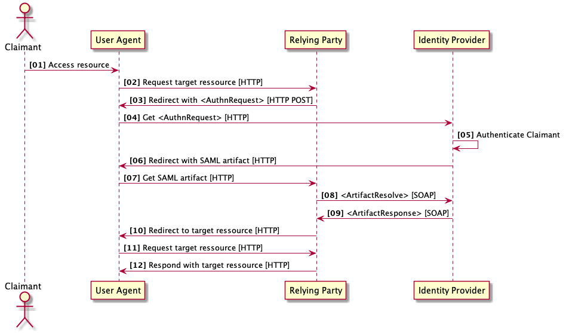

# Authenticate User
Transaction to authenticate a user at a identity provider certified for the Swiss EPR. Primary systems shall use this transaction to retrieve a IdP assertion. The IdP assertion is required to retrieve the XUA Assertion to be used with EPR transactions.

- [Overview](#overview)
- [Transaction](#transaction)
	* [Message Semantics](#message-semantics)
		- [Request Message](#request-message)
		- [Response Message](#response-message)
	* [Transport Protocol](#transport-protocol)
	* [Adit Log](#audit-log)
- [Security Requirements](#security-requirements)
- [Test Opportunity](#test-opportunity)

# Overview

Primary systems shall use this transaction to retrieve an IdP assertion authenticatin the user for the access to the Swiss EPR.

The requirements for the transaction are defined in
**[Annex 8](https://www.bag.admin.ch/dam/bag/de/dokumente/nat-gesundheitsstrategien/strategie-ehealth/gesetzgebung-elektronisches-patientendossier/gesetze/Anhang%208%20Ausgabe%202.pdf.download.pdf/DE_EPDV-EDI_Anhang_8_Ausgabe2.pdf)** of the ordinances of the Swiss EPR.

The EPR requires primary systems to implement authentication as described in the SAML 2.0 specification family, i.e.,
- **[Assertions and Protocols for the OASIS Security Assertion Markup Language (SAML) V2.0](http://docs.oasis-open.org/security/saml/v2.0/saml-core-2.0-os.pdf)**.
- **[Bindings for the OASIS Security Assertion Markup Language (SAML) V2.0](http://docs.oasis-open.org/security/saml/v2.0/saml-bindings-2.0-os.pdf)**.
- **[Profiles for the OASIS Security Assertion Markup Language (SAML) V2.0](http://docs.oasis-open.org/security/saml/v2.0/saml-profiles-2.0-os.pdf)**.

Primary systems do need implement all the bindings and profiles supported by the SAML 2.0 specification family.

In the Swiss EPR the following bindings are required:
- HTTP POST Binding.
- HTTP Artifact Binding.
- SAML SOAP Binding.    

In the Swiss EPR the following profiles are required:
- Web Browser SSO Profile.
- Single Logout Profile.

The usage of the profiles and binding used to authenticate user for the Swiss EPR is described in the following sections.

# Transaction



**Figure 1: Authentication Sequence Diagram**

## Message Semantics

TBD

```
code block here    
```

### Request Message

TBD

```
code block here    
```

### Response Message

TBD

```
code block here    
```

## Transport Protocol

TBD

```
code block here    
```

## Audit Log

TBD

```
code block here    
```

## Security Requirements   

TBD

# Test Opportunity

TBD
